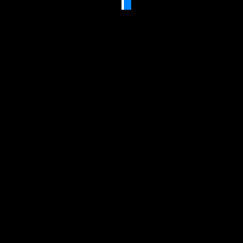

# Fordypningsoppgave---IT-Drift----Utvikling

> - `[Fordypningsuke skal blir to uke langt.]`
> - `[Fra uke 15 og 16.]`

 

**`Loading languages..`**

1. English
2. Norwegian

 

**Fordypning valg:**

1. IT-Drift
2. IT-Utvikling

 

**Chosen:**

- IT-Drift

 

## **`Skolen projekt:`**

<!--Tekst beskrivelse.-->

### **Fordypningsoppgave -- IT-Drift**

> "The measure of intelligence is the ability to change." ~Albert Einstein

<!--This command is used for quotes.-->

---

`Du skal fordypne deg i et eller flere temar innenfor IT-drift. Du velger selv hva du vil lære eller lage, og har ansvar for egen fremdrift.Men spør gjerne om hjelp ti valg eller struktur!`

`Målet er å få nye ferdigheter som gjør deg til en bedre IT-arbeider, og som du kan sette på CVen. Du skal samtidig plnlegge og dokumentere hva du gjør og lærer.`

---

### **Forslag på driftstemaer**

`Du velger selv hva du ville jobbe med, men må få det godkjent av en lærer. Her er noen forslag til aktuelle temar:`

- #### **Hacking/Cybersikkerhet**
  - Prøv for eksempler [TryHackME](https://tryhackme.com/), som er litt Duolingo-aktig.
  - [Cisco - Introduction To Cybersecurity](https://www.netacad.com/courses/introduction-to-cybersecurity?courseLang=en-US) er et populært og nybegynner-vennlig kurs

 

- #### **Databaser**
  - Prøv andre databse-systemer som PostSQL eller MongoDB. Lag scripts for å ta automatisk back-up av dataene.

 

- #### **Linux-server**
  - f.eks. oppsett av webserver, filserver eller automaterisering med bash. Test gjerne andre distroer.

 

- #### **Sertifiseringer**
  - (Kurs du kan ta som gir deg et diplom. For eksempler:
  - [Microsoft Certified: Azure Fundamentals](https://learn.microsoft.com/en-us/credentials/certifications/azure-fundamentals/?practice-assessment-type=certification) (AZ-900) om skytjenester og Azure
    )
  - [Microsoft 365 Certified: Fundamentals](https://learn.microsoft.com/en-us/credentials/certifications/microsoft-365-fundamentals/?practice-assessment-type=certification) (MS-900) om Office-programmene
     

- #### **Active Directory Domain Services (AD DS)**
  - Se for eksempel [her](https://www.youtube.com/watch?v=OfXJlmuoc20) for en rask forklaring av hva Active Directory er, ofg [her](https://github.com/kuben-it/Active-Directory-Lab) (GitHub) eller [her](https://ndla.no/e/driftsstotte-im-itk-vg2/datalab-med-windows-server/f86996e33d) (NDLA) for hjelp til å komme i gang.
  - **Annet:** gaming server (f.eks. Minecraft), Docker og containerisering, maskinlæring (f.eks. TensorFlow eller PyTorch), virtualisering, drift begrepliste/wiki.

 

<!--This command [url name](link) can be used to link a website in a text.-->

---

 

### **Felles - hva du Må gjøre**

###### **GitHub**

All dokumentasjon skal ligge i et GitHub-repository. Bruk GitHub projects til å planlegge arbeidet ditt, og flytt oppgaver gjennom kolonnene **_TO do_**, **_In progress_** og **_Done_** ettersom du jobber.

###### Repository skal inneholde:

- ##### Skjermbilder og/eller konfigurasjonsfiler som dokumenterer det du har satt opp
- ##### En README.md som beskriver hva prosjektet er, hvilke valg du tok og hvorfor
- ##### Den daglige loggen din

 

###### **Daglig logg**

#### Du skal skrive en logg hver dag. Loggen skal ligge i repositoriet ditt, f.eks. som en LOGG.md-fil.

Hver logginføring skal innholde:

- Hva du gjorde: en kort beskrivelse av dagens arbeid og hva du har lært
- Hva du skal gjøre neste gang
- Utfordringer. Hva som var vanskelig, og hvordan du forsøkte å løse det

 

---

 

`Project in choosing...`

<!--![URL]-->

 

<!--

Command for img/gif placeholder.-->

`Loading...`

> - Thoughts?:
>   - Gaming server (Minecraft)
>   - Homelab
>   - Dismantling pc
>   - etc.

 

**`Choosen project:`**

- `Dismantling devices` [Tuesday Logg](LoggProject_Drift/Tuesday140426.md)

> ---
>
> _`150426`_
>
> ### **Folder Structur:**
>
> - `Kuben Skole VG2 2025-2026`
>   - `Fordypningsoppgave IT VG 2`
>     - `Fordypningsoppgave---IT-Drift----Utvikling`
>       - **`DecoAnimation_gif`**
>         - `Indifferent_emoji1_gif.gif`
>         - `indifferent_emoji2_gif.gif`
>         - `indifferentemoji1_sprite.png`
>         - `indifferentemoji2_sprite.png`
>       - **`Dismantling`**
>         - `altibox_Ruter2`
>         - **`ASUS_Ruter1`**
>           - `Ruter1_backgreenplate_140426.png`
>           - `Ruter2_frontgreenplate3_140426.png`
>           - `Ruter3_frontgreenplate2_140426.png`
>           - `Ruter4_frontgreenplate_140426.png`
>           - `Ruter5_roof_140426.png`
>           - `Ruter6_back_140426.png`
>           - `Ruter7_front_140426.png`
>         - `Dismantling_tools`
>           - `Skrewdriver_redminus_sign_140426.png`
>           - `Skrewdriver_spiderbody_140426.png`
>           - `Skrewdriver_yellowstar_sign_140426.png`
>           - `Tools1_140426.png`
>           - `Tools2_140426.png`
>       - **`FDO_IT_gif`**
>         - `Fallingwaterdrop_reflect.gif`
>         - `Fallingwaterdrop2_reflect.gif`
>         - `Loadingscreen`
>       - **`LoggProject_Drift`**
>         - `VSCode_logg`
>           - `codeworksVSC_150426.png`
>         - `Monday130426.md`
>         - `Thursday90426.md`
>         - `Thursday160426.md`
>         - `Thursday230426`
>         - `Tuesday70426.md`
>         - `Tuesday140426.md`
>         - `Tuesday210426.md`
>         - `Wednesday80426.md`
>         - `Wednesday150426.md`
>       - **`README.md`**
>
> ---

> ---
>
> Date & time written:
>
> - `70426`
> - `80426`
> - `90426`
> - `130426`
> - `140426`
> - `150426`
>
> ---
